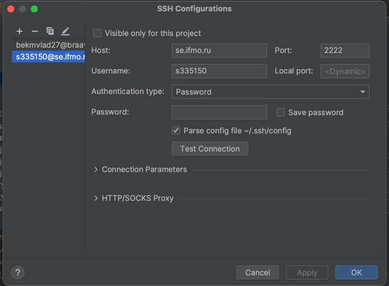

# Курсовая работа ИСБД

## Важно

1) Если не установлен maven - `brew install maven`
2) После запуска проекта `mvn clean install` (на всякий случай)

## Локальный запуск

1) Устанавливаем docker desktop https://www.docker.com/products/docker-desktop/
2) Запускаем
3) Выполняем команду `docker-compose -f docker-compose.yml up -d`
4) Теперь мы увидели в приложении докера запущенный контейнер
5) Далее необходимо подключиться к бд (данные указаны чуть ниже)
6) Выполняем скрипт resources/changelog/base.sql
7) Ура, можно делать

## Подключение к бд из Idea

1) Открываем вкладку database (в правом верхнем углу под maven)
2) Добавляем новый datasource postgresql
3) Настраиваем SSH Tunnel (отдельная вкладка SSH/SSL)
4) Ставим галочку use ssh tunnel
5) Далее `...` и переходим к настройке

Должно выглядеть примерно так, после чего нужно будет ввести пароль. 
6) Данные для подключения:

## Тоже важно
1) Нужно прокинуть порты следующей командой `ssh -L 5432:localhost:5432 {helios_username}@helios.se.ifmo.ru -p 2222`
2) Чтобы протестировать то что отмечено в notion зеленой галочкой, нужно выполнить скрипт base.sql

## План разработки:

Сюда по мере обновления буду добавлять пункты которые в ближайшее время хотим реализовать. Не думаю что тут важно в
каком порядке делать, стоит просто держать друг дурга в курсе что уже сделано.

### Основной план

Фронт:

- ~~Табличка для отображения всех цветов~~
- Добавить все поля в табличку
- Редактирование отдельного цветка (изменение всех полей)
- Удаление цветка
- Добавление кнопки "Создание тестовых данных". Там нужно просто запрос отправить, позже опишу ручку, чтобы я мог
  нагенерить новые данные для таблицы чтобы легче тестить было.

Бек:

- ~~Создать базовый проект~~
- ~~Настроить подключение к бд и получение от туда данных~~
- Описать уже имеющиеся ручки
- Добавить ручку по удалению моделей
- Добавить ручку по редактированию моделей
- Придумать еще фичей